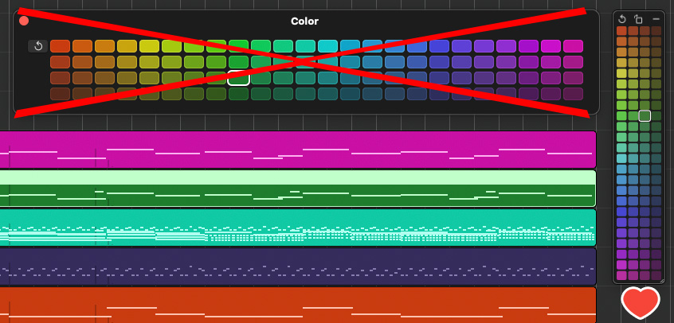

# Logic Palette

Бесплатная компактная палитра цветов для Logic Pro. Маленькая плавающая панель с теми же 96 цветами, что и в Logic, — не перекрывает треки и панель инструментов.



[English below](#english)

## Возможности

- Те же 96 цветов, что в штатном окне Color. Работает с треками и регионами, отмена — ⌘Z.
- Три вида: вертикальный, горизонтальный и квадратный. Размер меняется за угол, панель сворачивается в маленькую кнопку.
- Появляется при запуске Logic и прячется при выходе.
- Меньше 1 МБ, нативный код, без плагинов и фоновых сервисов. Файлы Logic не изменяются.
- Интерфейс на русском и английском.

**Требования:** macOS 13 Ventura или новее, Intel или Apple Silicon, Logic Pro.

## Установка

1. Скачайте `Logic Palette X.Y.pkg` (или `.dmg`) на странице [Releases](../../releases/latest).
2. Откройте установщик — приложение установится в «Программы».
3. При первом запуске разрешите доступ в «Системные настройки → Конфиденциальность и безопасность → Универсальный доступ». Без него macOS не позволяет нажимать цвет в окне Logic.

Если значок приложения перечёркнут или macOS пишет, что оно повреждено, выполните в Терминале:

```sh
APP="/Applications/Logic Palette.app"
chmod +x "$APP/Contents/MacOS/LogicPalette"
xattr -cr "$APP"
codesign --force --deep --sign - "$APP"
```

**Удаление:** правый клик по палитре → «Выход», затем перетащите «Logic Palette» из «Программ» в Корзину.

## Как это работает

Палитра не встраивается в Logic. Когда вы нажимаете цвет, она через Accessibility API открывает штатное окно Color в Logic, нажимает нужную плитку и закрывает окно, если открывала его сама. Поэтому результат точно такой же, как при покраске из родной палитры.

## Сборка из исходников

Нужны Xcode Command Line Tools (`xcode-select --install`).

```sh
cd LogicPalette
./build.sh               # build/Logic Palette.app (универсальный: x86_64 + arm64)
./build.sh --install     # собрать и установить в /Applications
./build.sh --pkg --dmg   # собрать установщики .pkg и .dmg в корне проекта
```

Установщики заодно копируются в `site/downloads/` для сайта.

**Подпись.** Скрипт подписывает приложение сертификатом с именем `LogicPalette Local Signing`, если он есть в Связке ключей; иначе — ad-hoc. Постоянный сертификат нужен, чтобы разрешение «Универсальный доступ» не сбрасывалось после каждой пересборки. Создать его: «Связка ключей» → меню «Связка ключей» → «Ассистент сертификации» → «Создать сертификат», имя `LogicPalette Local Signing`, тип «Подпись кода».

## Структура

```
LogicPalette/       исходники приложения (Swift, один файл main.swift) и скрипт сборки
site/               лендинг на PHP с админкой и inline-редактором
LICENSE             лицензия MIT
```

## Сайт

Одностраничный лендинг (RU/EN) со счётчиком скачиваний, статистикой и редактированием текстов и картинок прямо на странице.

**Требования:** PHP 8.1+ с расширениями `pdo_sqlite` и `gd`, Apache (`.htaccess`) или любой сервер, который закрывает папки `includes/` и `data/`.

**Запуск локально:**

```sh
cd site
cp .env.example .env
php -r "echo password_hash('ваш-пароль', PASSWORD_DEFAULT), PHP_EOL;"   # вставьте результат в ADMIN_PASSWORD_HASH
php -S 127.0.0.1:8090 router.php
```

Откройте http://127.0.0.1:8090. Вход в админку — по полупрозрачному карандашу внизу страницы или по адресу `/admin`. После входа сверху появляется панель редактора: тексты правятся кликом, картинки заменяются перетаскиванием файла, там же настройки счётчика и SEO.

Без `router.php` встроенный сервер PHP отдаёт `.env` и базу любому — запускайте только с ним.

**На хостинге:**

1. Загрузите содержимое `site/` в корень сайта.
2. Создайте `.env` по образцу `.env.example` и задайте свои логин, хеш пароля и случайный `APP_SECRET`.
3. Положите установщики в `site/downloads/` (их создаёт `./build.sh --pkg --dmg`) или загрузите вручную с именами `Logic-Palette-X.Y.pkg` и `Logic-Palette-X.Y.dmg`.
4. Папки `data/` и `assets/img/uploads/` должны быть доступны PHP на запись.

**Безопасность:** CSRF-защита всех форм, ограничение попыток входа, пароль хранится только в виде хеша, IP посетителей — только в виде хеша, строгая Content Security Policy, загружаемые картинки перекодируются.

## Лицензия

[MIT](LICENSE) © 2026 [STM Webcode Systems](https://stm-project.ru)

Logic Pro — товарный знак Apple Inc. Проект не связан с Apple.

---

## English

**Logic Palette** is a free, compact color palette for Logic Pro: a small floating panel with the same 96 colors as Logic's Color window, without covering your tracks and toolbar.

- Works with tracks and regions; undo with ⌘Z.
- Vertical, horizontal and square layouts; resizable; collapses to a small button.
- Shows up with Logic and hides when Logic quits. Under 1 MB, native code, no plug-ins, Logic's files stay untouched.
- Requires macOS 13+ (Intel or Apple Silicon).

**Install:** download the `.pkg` or `.dmg` from [Releases](../../releases/latest), then grant Accessibility access in System Settings → Privacy & Security → Accessibility. If macOS says the app is damaged, run the Terminal commands from the "Установка" section above.

**Build:** `cd LogicPalette && ./build.sh --install` (requires Xcode Command Line Tools).

**Website:** `site/` is a PHP 8.1+ landing page with an admin panel and inline editor. Copy `.env.example` to `.env`, set the admin password hash, and run `php -S 127.0.0.1:8090 router.php`.

License: [MIT](LICENSE).
